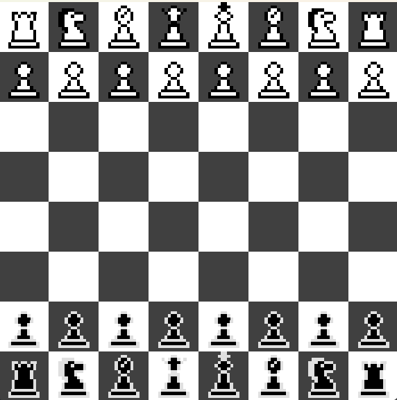
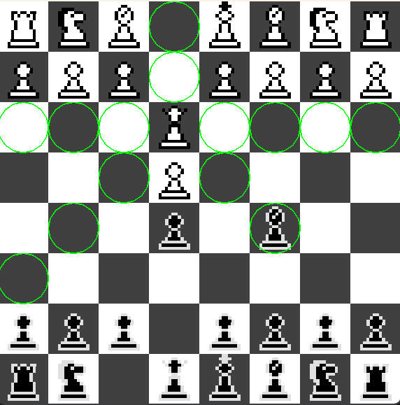
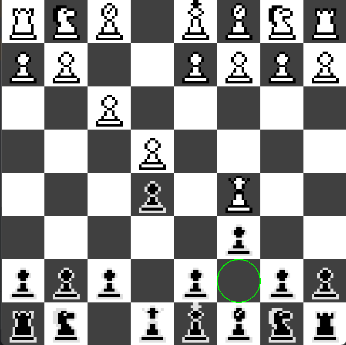
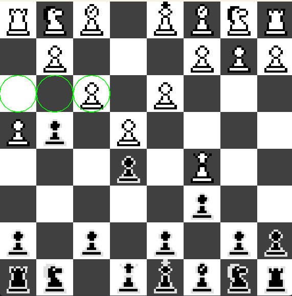
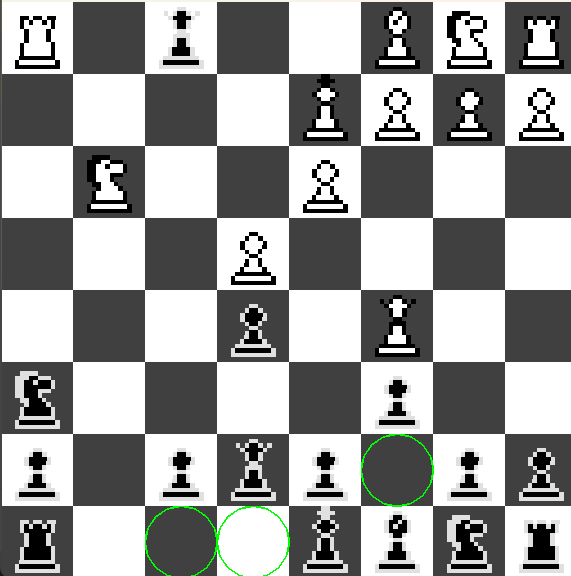
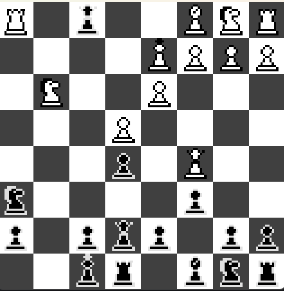
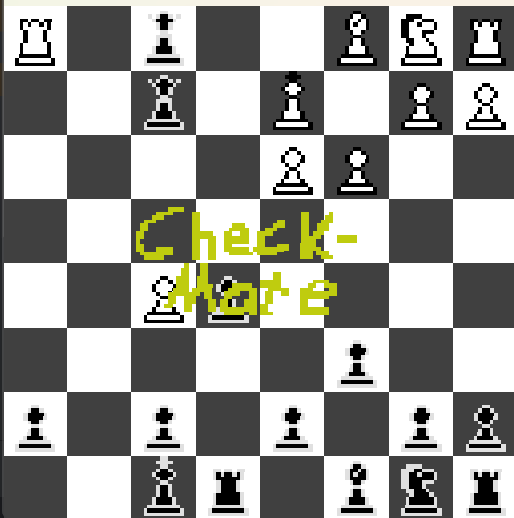

# Chess

A fully playable chess game implemented in Java with a custom Swing-based graphical user interface.  
The project focuses on correct chess rules, legal move validation, and interactive gameplay.

## Features
- Interactive GUI built using Java Swing (`JPanel`)
- Full legal move generation and validation
- Detection of check and checkmate states
- Visual highlighting of legal moves
- Support for advanced chess rules:
  - Castling (king-side and queen-side)
  - En passant
  - Pawn promotion (currently defaults to queen)

## Screenshots

### Initial position


### Legal move highlighting
Selecting a piece highlights all legal moves while excluding moves that would leave the king in check.



### Illegal move detection
Moves that would result in check (including discovered checks) are excluded from the move set. (Under you see the possible moves for the black king)



### En passant
Implements en passant captures immediately following a valid double pawn advance.



### Castling
Both king-side and queen-side castling are supported and validated according to chess rules.





### Checkmate detection
The game detects checkmate and displays a game-over screen when the game ends. (In order to reset one has to close then open the program)



## Requirements
- Java JDK 17 (or compatible version)
- No global Gradle installation required (Gradle Wrapper included)

## Project Structure
- `src/` – Java source code
- `res/` – Game resources (piece sprites, assets)
- `build.gradle` – Gradle build configuration
- `screenshots/` – Screenshots used in this README

## Build
To compile the project, run:

```bash
./gradlew build
```
(On Windows: gradlew build)

## Run
To run the application:

```bash
./gradlew run
```
(On Windows: gradlew run)

## Notes
- This project uses the Gradle Wrapper, so Gradle does not need to be installed separately.
- Build output is generated in the build/ directory.
- The project follows a simple custom source layout (src/ and res/).

## Author
Oscar Albert Höglund
